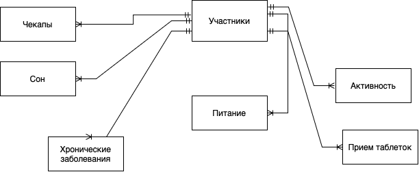

# Health Monitor

## Введение

##### ***Цель работы:***
*Получение практических навыков проектирования и разработки базы данных для мониторинга состояния здоровья человека. В рамках проекта реализовано создание концептуальной, логической и физической моделей, а также написание DDL/DML скриптов, хранимых процедур, представлений, триггеров, индексов и тестовых запросов для проверки качества данных.*

-------
#### ***Инструменты:***
PostgreSQL 15, Python 3.8+

--------
#### ***Описание проекта:***

*Проект направлен на создание системы мониторинга состояния здоровья, которая фиксирует и анализирует следующие данные:*

- **Личные данные участников (Пациенты):** ФИО, дата рождения, пол, контакты.
- **Дневник сна:** Дата, время начала и окончания сна, оценка качества сна (по балльной системе), дополнительные комментарии.
- **Дневник питания:** Дата и время приёма пищи, тип приёма (завтрак, обед, ужин, перекус), описание блюд, калорийность и состав (белки, жиры, углеводы).
- **Дневник активности:** Дата, количество шагов, пройденная дистанция, сожжённые калории.
- **Медицинские обследования (SCD2):** История осмотров врачей с версионированием для отслеживания динамики состояния здоровья.
- **Назначения лекарств (SCD2):** Информация о назначениях препаратов и витаминов с версионированием, позволяющим отслеживать изменения в режиме лечения.
- **Хронические заболевания:** Данные о хронических заболеваниях, дате постановки диагноза, статусе (обострение/ремиссия) и комментариях.

-------

#### ***Предметная область и сущности:***

**Сущности проекта:**

1. **Participants (Пациенты):**  
   Хранит основную информацию о пациентах, включая уникальный идентификатор, ФИО, дату рождения, пол и контакты.

2. **Chronic Conditions (Хронические заболевания):**  
   Фиксирует сведения о хронических заболеваниях, диагностированных у пациентов (название, дата постановки диагноза, статус, примечания).

3. **Sleep Log (Дневник сна):**  
   Содержит данные о сне: дата, время начала и окончания, оценка качества сна и дополнительные комментарии.

4. **Nutrition Log (Дневник питания):**  
   Отражает информацию о приёмах пищи, включая дату/время, тип приёма, описание блюд, калории и состав (белки, жиры, углеводы).

5. **Activity Log (Дневник активности):**  
   Записывает данные о физической активности, такие как количество шагов, пройденная дистанция и сожжённые калории.

6. **Medical Checkups (Медицинские обследования, SCD2):**  
   Хранит историю осмотров врачей с механизмом версионирования, позволяющим фиксировать изменения в состоянии здоровья пациентов.

7. **Medication Intake (Назначения лекарств, SCD2):**  
   Фиксирует назначения лекарственных средств и витаминов с версионированием, позволяющим отслеживать изменения в дозировке и расписании приёма.

-------

### ***Подробное описание сущностей и их назначения***

1. **Participants:**  
   Основная сущность, содержащая личные данные пациента.  
   Атрибуты:  
   - `participant_id` – уникальный идентификатор;  
   - `first_name`, `last_name` – имя и фамилия;  
   - `date_of_birth` – дата рождения;  
   - `gender` – пол;  
   - `phone`, `email` – контактные данные.

2. **Chronic Conditions:**  
   Сущность для хранения информации о хронических заболеваниях.  
   Атрибуты:  
   - `condition_id` – уникальный идентификатор заболевания;  
   - `participant_id` – ссылка на пациента;  
   - `disease_name` – название заболевания;  
   - `diagnosis_date` – дата постановки диагноза;  
   - `current_status` – статус (обострение/ремиссия);  
   - `comments` – примечания.

3. **Sleep Log:**  
   Фиксирует данные о качестве и продолжительности сна.  
   Атрибуты:  
   - `sleep_log_id` – уникальный идентификатор записи;  
   - `participant_id` – ссылка на пациента;  
   - `sleep_date` – дата записи;  
   - `sleep_start_time` и `sleep_end_time` – время начала и окончания сна;  
   - `sleep_quality` – оценка сна;  
   - `notes` – дополнительные комментарии.

4. **Nutrition Log:**  
   Содержит информацию о приёмах пищи.  
   Атрибуты:  
   - `nutrition_log_id` – уникальный идентификатор записи;  
   - `participant_id` – ссылка на пациента;  
   - `log_datetime` – дата и время приёма пищи;  
   - `meal_type` – тип приёма (завтрак, обед, ужин, перекус);  
   - `food_description` – описание блюда;  
   - `calories`, `proteins`, `fats`, `carbs` – показатели энергетической ценности.

5. **Activity Log:**  
   Записывает данные о физической активности пациента.  
   Атрибуты:  
   - `activity_log_id` – уникальный идентификатор записи;  
   - `participant_id` – ссылка на пациента;  
   - `activity_date` – дата активности;  
   - `steps_count` – количество шагов;  
   - `distance_km` – пройденная дистанция;  
   - `calories_burned` – сожжённые калории.

6. **Medical Checkups (SCD2):**  
   Фиксирует историю медицинских осмотров с механизмом версионирования.  
   Атрибуты:  
   - `checkup_id` – уникальный идентификатор осмотра;  
   - `participant_id` – ссылка на пациента;  
   - `checkup_date` – дата осмотра;  
   - `doctor_specialty` – специализация врача;  
   - `diagnosis_summary` – результаты осмотра;  
   - `recommendations` – рекомендации врача;  
   - `effective_start_date`, `effective_end_date` – сроки актуальности записи;  
   - `is_current` – флаг текущей версии записи.

7. **Medication Intake (SCD2):**  
   Хранит информацию о назначениях лекарств с версионированием.  
   Атрибуты:  
   - `medication_id` – уникальный идентификатор назначения;  
   - `participant_id` – ссылка на пациента;  
   - `medication_name` – название препарата;  
   - `dosage` – дозировка;  
   - `times_per_day` – частота приёма;  
   - `notes` – дополнительные комментарии;  
   - `effective_start_date`, `effective_end_date` – сроки действия назначения;  
   - `is_current` – флаг текущей версии.

-------

### ***Цель проекта:***

Создать базу данных для мониторинга состояния здоровья, которая позволит:
- Анализировать качество сна, питание и физическую активность пациентов;
- Отслеживать динамику состояния здоровья через историю медицинских обследований;
- Контролировать назначения лекарств и выявлять изменения в режиме лечения;
- Вести учёт хронических заболеваний для своевременного реагирования и профилактики.

-------

### ***Актуальность области:***

Мониторинг здоровья является актуальной задачей в современной медицине, поскольку:
- Своевременное обнаружение изменений в состоянии здоровья помогает предотвратить развитие заболеваний;
- Систематизированный сбор данных позволяет проводить научные исследования и анализ эффективности лечения;
- Персонализированный подход к лечению требует подробной информации о режиме жизни и состоянии пациента.

